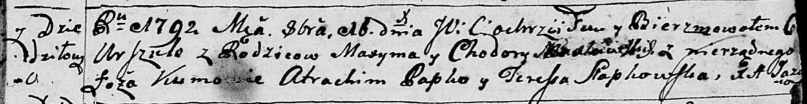

**Максим (Maxym)**

16 октября 1792 г -- крещение дочери Урсулы (НИАБ 136-13-894, лист 17,
№63/1792-р (ориг)).

**НИАБ 136-13-894:** Лист 17. **Метрическая запись №63/1792-р (ориг).**

{width="6.496527777777778in"
height="0.8421544181977253in"}

Дедиловичская Покровская церковь. 16 октября 1792 года. Метрическая
запись о крещении.

\...lawska Urszula -- незаконнорожденная дочь родителей с деревни
Дедиловичи.

\...lawski Maxym -- отец.

\...lawska Chodora -- мать.

Papko Atrachim - кум.

Słapkowska Teresa - кума.

Jazgunowicz Antoni -- ксёндз.
