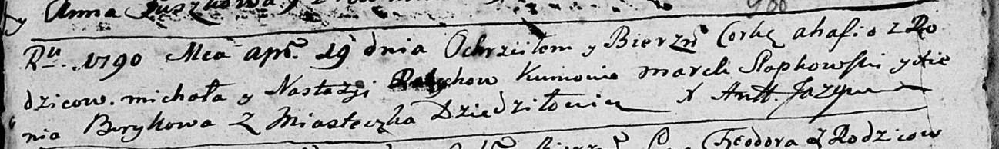

**Михал (Michał)**

19 апреля 1790 г -- крещение дочери Агафии (НИАБ 136-13-894, лист 9об,
№24/1790-р (ориг)).

**НИАБ 136-13-894:** Лист 9об. **Метрическая запись №24/1790-р (ориг).**

Дедиловичская Покровская церковь. 19 апреля 1790 года. Метрическая
запись о крещении.

? Ahafia -- дочь родителей с деревни Дедиловичи.

? Michał -- отец.

? Nastazya -- мать.

Słapkowski Marck - кум.

Brytkowa? Xienia - кума.

Jazgunowicz Antoni -- ксёндз.
