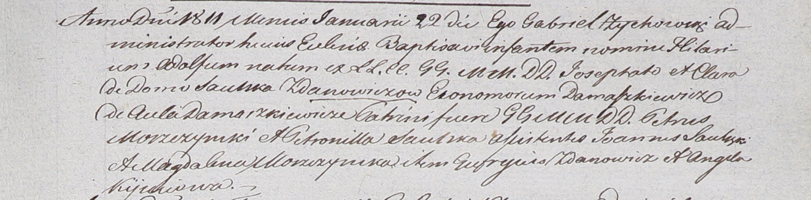

**Жданович (Саульская) Клара (Zdanowiczowa Clara z Saulskich)**

22 января 1811 г -- крещение сына Гилярия Адольфа (НИАБ 937-4-32, лист
23, №1/1811-р)

**НИАБ 937-4-32:** Лист 23. **Метрическая запись №1/1811-р.**

{width="6.496527777777778in"
height="1.6090277777777777in"}

Дедиловичский костел Наисвятейшего Сердца Иисуса. 22 января 1811 года.
Метрическая запись о крещении.

Zdanowicz Hilarius Adolfus -- сын шляхтичей со двора Домашковичи.

Zdanowicz Josephat -- отец, эконом Домашковичский.

Zdanowiczowa Clara z Saulskich -- мать.

Moszczynski Petrus -- крестный отец, шляхтич.

Saulska Petronilla -- крестная мать, шляхтянка.

Saulski Joann - ассистент, шляхтич.

Moszczynska Magdalena - ассистентка, шляхтянка.

Zdanowicz Georgius - ассистент, шляхтич.

Kijucowa Angela - ассистентка, шляхтянка.

Zychowski Gabriel -- ксёндз.
