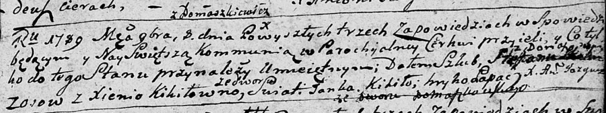

**Скакун (Кикило) Ксеня (Skakunowa Xienia z Kikiłow)**

8 ноября 1789 г -- венчание с Степаном Скакуном с деревни Осово (НИАБ
136-13-893, лист 68, №9/1789-б (ориг))

**НИАБ 136-13-894:** Лист 68. **Метрическая запись №9/1789-б (ориг).**

{width="6.496527777777778in"
height="1.2149562554680664in"}

Дедиловичская Покровская церковь. 8 ноября 1789 года. Метрическая запись
о венчании.

Skakun Stefan -- жених, с деревни Осовo.

Kikiłowna Xienia -- невеста, со двора Домашковичи.

Kikiło Janka -- свидетель.

Łapać Hryhor -- свидетель.

Jazgunowicz Antoni -- ксёндз.
