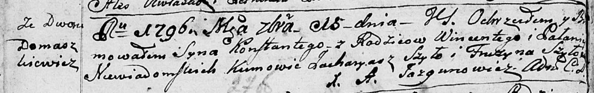
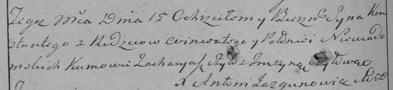

**Неведомская Паланья (Niewiadomska Pałanija)**

15 января 1796 г -- крещение сына Константия (НИАБ 136-13-894, лист
27об, №5/1796-р (ориг)), (РГИА 823-2-18, лист 254об, №4/1796-р (коп)).

**НИАБ 136-13-894:** Лист 27об. **Метрическая запись №5/1796-р (ориг).**

Дедиловичская Покровская церковь. 15 января 1796 года. Метрическая
запись о крещении.

Niewiadomski Konstanty -- сын родителей со двора Домашковичи.

Niewiadomski Wincenty -- отец.

Niewiadomska Pałanija -- мать.

Szyło Zacharyasz - кум.

Szyłowa Fruzyna - кума.

Jazgunowicz Antoni -- ксёндз.

**РГИА 823-2-18:** Лист 254об. **Метрическая запись №4/1796-р (коп).**

Дедиловичская Покровская церковь. 15 января 1796 года. Метрическая
запись о крещении.

Niewiadomski Konstanty -- сын \[родителей со двора Домашковичи\].

Niewiadomski Wincenty -- отец.

Niewiadomska Połonieja -- мать.

Szyło Zacharyasz -- кум.

Szyłowa Fruzyna -- кума.

Jazgunowicz Antoni -- ксёндз.
