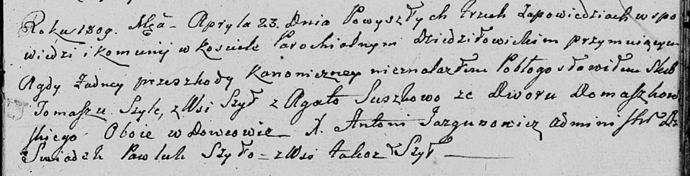

**Шило (в предыдущем браке Сушко) Агата (Szyłowa (Suszkowa) Agata)**

23 апреля 1809 г -- венчание с вдовцом Томашом Шило с деревни Шилы (НИАБ
136-13-920, лист 15, №7/1809-б (ориг)).

**НИАБ 136-13-894:** Лист 15. **Метрическая запись №7/1809-б (ориг).**

{width="6.496527777777778in"
height="1.663523622047244in"}

Дедиловичская Покровская церковь. 23 апреля 1809 года. Метрическая
запись о венчании.

Szyło Tomasz -- жених, вдовец, с деревни Шилы.

Suszkowa Agata -- невеста, вдова, двор Домашковичи.

Szyło Pawluk -- свидетель, с деревни Шилы.

Jazgunowicz Antoni -- ксёндз.
