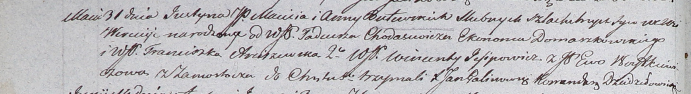

**Ходасевич Тадеуш (Chodasewicz Tadeusz)**

31 мая 1803 г -- крестный отец Юстына, сына шляхтичей Мацея и Анны
Бутовских с деревни Веретей (НИАБ 937-4-32, лист 9об, №14/1803-р).

**НИАБ 937-4-32:** Лист 9об. **Метрическая запись №14/1803-р.**

Дедиловичский костел Наисвятейшего Сердца Иисуса. 31 мая 1803 года.
Метрическая запись о крещении.

Butewski Justyn -- сын шляхтичей с деревни Веретей.

Butewski Maciey -- отец.

Butewska Anna -- мать.

Chodasewicz Tadeusz -- крестный отец, шляхтич, эконом Домашковичский.

Arciszewska Franciszka -- крестная мать, шляхтянка.

Jesipowicz Wincenty - ассистент, шляхтич.

Woytkiewiczowa Ewa - ассистентка, шляхтянка, с деревни Замосточье.

Galinowski Joann -- ксёндз, комендант Дедиловичского костела.
