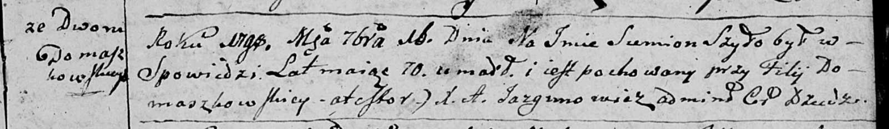

**Шило Семён (Szyło Siemion)**

16 сентября 1798 г -- отпевание, умер в возрасте 70 лет (родился около
1728 г) (НИАБ 136-13-919, лист 8, №16/1798-у (ориг)).

**НИАБ 136-13-919:** Лист 8. **Метрическая запись №16/1798-у (ориг).**

Дедиловичская Покровская церковь. 16 сентября 1798 года. Метрическая
запись об отпевании.

Szyło Siemion -- умерший, 70 лет, со двора Домашковичи, похоронен на
кладбище при филии Домашковичской.

Jazgunowicz Antoni -- ксёндз.
