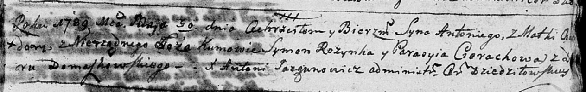

**Федора (Chwiedora)**

30 мая 1789 г -- крещение сына Антона (НИАБ 136-13-894, лист 7,
№30/1789-р (ориг)).

**НИАБ 136-13-894:** Лист 7. **Метрическая запись №30/1789-р (ориг).**

{width="6.496527777777778in"
height="1.027884951881015in"}

Дедиловичская Покровская церковь. 30 мая 1789 года. Метрическая запись о
крещении.

Antonij -- незаконнорожденный сын матери со двора Домашковичи.

Chwiedora -- мать.

Rozynka Symon - кум.

Cierachowa Parasyia - кума.

Jazgunowicz Antoni -- ксёндз.
