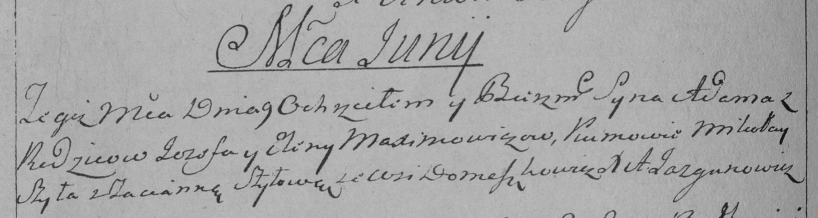

**Алексевич Адам Иосифов (Alexiewicz Adam)**

9 июня 1793 г -- крещение (НИАБ 136-13-894, лист 20, №48/1793-р (ориг),
(РГИА 823-2-18, лист 247об, №23/1793-р (коп)).

**НИАБ 136-13-894:** Лист 20. **Метрическая запись №48/1793-р (ориг).**

{width="6.496527777777778in"
height="0.49885608048993874in"}

Дедиловичская Покровская церковь. 9 июня 1793 года. Метрическая запись о
крещении.

Alexiewicz Adam -- сын родителей с деревни Домашковичи.

Alexiewicz Jozef -- отец.

Alexiewiczowa Elena -- мать.

Szyło Mikołay - кум.

Szyłowa Taćiana - кума.

Jazgunowicz Antoni -- ксёндз.

**РГИА 823-2-18:** Лист 247об. **Метрическая запись №23/1793-р (коп).**

{width="6.496527777777778in"
height="1.73125in"}

Дедиловичская Покровская церковь. 9 июня 1793 года. Метрическая запись о
крещении.

\[Alexiewicz\] Adam -- сын родителей с деревни Домашковичи.

\[Alexiewicz\] Jozef -- отец.

\[Alexiewiczowa\] Elena -- мать.

Szyło Mikołay -- кум.

Szyłowa Tacianna -- кума.

Jazgunowicz Antoni -- ксёндз.
