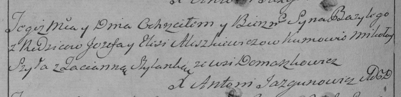

**Алешкевич Иосиф (Aleszkiewicz Jozef)**

18 января 1797 г -- крещение сына Базилия (НИАБ 136-13-894, лист 32,
№7/1797-р (ориг), (РГИА 823-2-18, лист 258об, №7/1797-р (коп)).

**НИАБ 136-13-894:** Лист 32. **Метрическая запись №7/1797-р (ориг).**

{width="6.496527777777778in"
height="1.0614096675415574in"}

Дедиловичская Покровская церковь. 18 января 1797 года. Метрическая
запись о крещении.

Alieszkiewicz Bazili -- сын родителей с деревни Домашковичи.

Aleszkiewicz Jozef -- отец.

Aleszkiewiczowa Elesia -- мать.

Szyło Mikołay - кум.

Szyłanka Taciana - кума.

Jazgunowicz Antoni -- ксёндз.

**РГИА 823-2-18:** Лист 258об. **Метрическая запись №7/1797-р (коп).**

{width="6.496527777777778in"
height="1.570138888888889in"}

Дедиловичская Покровская церковь. 18 января 1797 года. Метрическая
запись о крещении.

Aleszkiewicz Bazyli -- сын родителей с деревни Домашковичи.

Aleszkiewicz Jozef -- отец.

Aleszkiewiczowa Elesia -- мать.

Szyła Mikołay -- кум.

Szyłanka Tacianna -- кума.

Jazgunowicz Antoni -- ксёндз.
