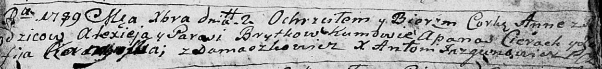

**Бритко Алексей (Brytko Alexiej)**

2 декабря 1789 г -- крещение дочери Анны (НИАБ 136-13-894, лист 8,
№62/1789-р (ориг).

**НИАБ 136-13-894:** Лист 8. **Метрическая запись №62/1789-р (ориг).**

Дедиловичская Покровская церковь. 2 декабря 1789 года. Метрическая
запись о крещении.

Brytkowna Anna -- дочь родителей с деревни Домашковичи.

Brytko Alexiej -- отец.

Brytkowa Parasia -- мать.

Cierach Apanas - кум.

Kaminska? Zofija - кума.

Jazgunowicz Antoni -- ксёндз.
