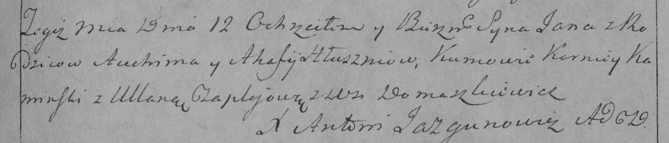

**Глушень (Скакун) Агафия (Hłuszniowa Ahafija z Skakunow)**

7 сентября 1791 г -- венчание с Авхимом Глушенем с деревни Домашковичи с
деревни Осово (НИАБ 136-13-894, лист 70, №17/1791-б (ориг)).

12 января 1794 г -- крещение сына Яна (НИАБ 136-13-894, лист 21,
№3/1794-р (ориг), (РГИА 823-2-18, лист 249, №3/1794-р (коп)).

27 сентября 1797 г -- крещение сына Хомы (НИАБ 136-13-894, лист 34об,
№58/1797-р (ориг), (РГИА 823-2-18, лист 260об, №39/1797-р (коп)).

**НИАБ 136-13-894:** Лист 70. **Метрическая запись №17/1791-б (ориг).**

{width="6.496527777777778in"
height="1.094935476815398in"}

Дедиловичская Покровская церковь. 7 сентября 1791 года. Метрическая
запись о венчании.

Hłuszeń Auchim -- жених, с деревни Домашковичи.

Skakunowna Ahafija -- невеста, с деревни Осовo.

Skakun Jhnat -- свидетель.

Kawal Hryhor -- свидетель.

Jazgunowicz Antoni -- ксёндз.

**НИАБ 136-13-894:** Лист 21. **Метрическая запись №3/1794-р (ориг).**

{width="6.496527777777778in"
height="1.1707020997375328in"}

Дедиловичская Покровская церковь. 12 января 1794 года. Метрическая
запись о крещении.

Hłuszeń Jan -- сын селян с деревни Домашковичи.

Hłuszeń Auchim -- отец.

Hłuszniowa Ahafija-- мать.

Kaminski Karniey - кум.

Czaplaiowa Ullana - кума.

Jazgunowicz Antoni -- ксёндз.

**РГИА 823-2-18:** Лист 249. **Метрическая запись №3/1794-р (коп).**

{width="6.496527777777778in"
height="1.3902777777777777in"}

Дедиловичская Покровская церковь. 12 января 1794 года. Метрическая
запись о крещении.

Hłuszeń Jan -- сын родителей с деревни Домашковичи.

Hłuszeń Auchim -- отец.

Hłuszniowa Ahafija -- мать.

Kaminski Korniey -- кум.

Czaplajowa Ullana -- кума.

Jazgunowicz Antoni -- ксёндз.

Лист 34об. **Метрическая запись №58/1797-р (ориг).**

{width="6.496527777777778in"
height="1.2706080489938758in"}

Дедиловичская Покровская церковь. 27 сентября 1797 года. Метрическая
запись о крещении.

Hłuszeń Tomasz -- сын родителей с деревни Домашковичи.

Hłuszeń Jachim -- отец.

Hłuszniowa Ahaffia -- мать.

Kaminski Karniey - кум.

Huzniakowa Nastazyia - кума.

Jazgunowicz Antoni -- ксёндз.

**РГИА 823-2-18:** Лист 260об. **Метрическая запись №39/1797-р (коп).**

{width="6.496527777777778in"
height="1.5659722222222223in"}

Дедиловичская Покровская церковь. 27 сентября 1797 года. Метрическая
запись о крещении.

Hłuszeń Tomasz -- сын родителей с деревни Домашковичи.

Hłuszeń Jofim -- отец.

Hłuszniowa Ahafija -- мать.

Kaminski Karniey -- кум.

Huzniakowa Nastazya -- кума.

Jazgunowicz Antoni -- ксёндз.
