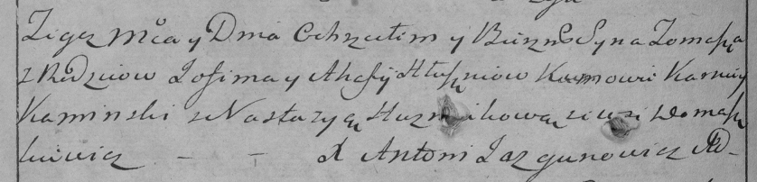

**Глушень Хома Авхимов (Hłuszeń Tomasz)**

27 сентября 1797 г -- крещение (НИАБ 136-13-894, лист 34об, №58/1797-р
(ориг), (РГИА 823-2-18, лист 260об, №39/1797-р (коп)).

Лист 34об. **Метрическая запись №58/1797-р (ориг).**

{width="6.496527777777778in"
height="1.2706080489938758in"}

Дедиловичская Покровская церковь. 27 сентября 1797 года. Метрическая
запись о крещении.

Hłuszeń Tomasz -- сын родителей с деревни Домашковичи.

Hłuszeń Jachim -- отец.

Hłuszniowa Ahaffia -- мать.

Kaminski Karniey - кум.

Huzniakowa Nastazyia - кума.

Jazgunowicz Antoni -- ксёндз.

**РГИА 823-2-18:** Лист 260об. **Метрическая запись №39/1797-р (коп).**

{width="6.496527777777778in"
height="1.5659722222222223in"}

Дедиловичская Покровская церковь. 27 сентября 1797 года. Метрическая
запись о крещении.

Hłuszeń Tomasz -- сын родителей с деревни Домашковичи.

Hłuszeń Jofim -- отец.

Hłuszniowa Ahafija -- мать.

Kaminski Karniey -- кум.

Huzniakowa Nastazya -- кума.

Jazgunowicz Antoni -- ксёндз.
