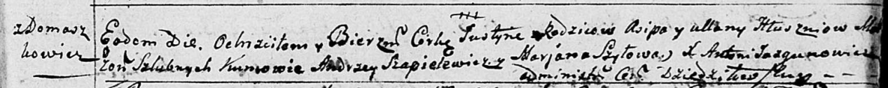

**Глушень Осип (Hłuszeń Osip, Jezef)**

25 сентября 1782 г -- крещение дочери Фрузыны (РГИА 823-2-18, лист
222об, №6/1782-р (коп)).

2 мая 1787 г -- крещение дочери Марьяны (НИАБ 136-13-894, лист 1об,
№17/1787-р (ориг).

18 мая 1791 г -- крещение дочери Юстыны (НИАБ 136-13-894, лист 13,
№21/1791-р (ориг).

20 июня 1792 г -- крещение сына Яна (НИАБ 136-13-894, лист 16,
№36/1792-р (ориг), (РГИА 823-2-18, лист 244, №16/1792-р (коп)).

**РГИА 823-2-18:** Лист 222об. **Метрическая запись №6/1782-р (коп).**

{width="6.496527777777778in"
height="1.6708333333333334in"}

Дедиловичская униатская церковь. 25 сентября 1782 года. Метрическая
запись о крещении.

Hłuszniowna Fruzyna -- дочь родителей с деревни Домашковичи.

Hłuszeń Osip -- отец.

Hłuszniowa Uljana -- мать.

Szapielewicz Andrzey -- кум.

Szyłonka Marjanna - кума.

Jazgunowicz Antoni -- ксёндз.

**НИАБ 136-13-894:** Лист 1об. **Метрическая запись №17/1787-р (ориг).**

{width="6.496527777777778in"
height="0.9078641732283464in"}

Дедиловичская Покровская церковь. 2 мая 1787 года. Метрическая запись о
крещении.

Hłuszńiowna Mariana -- дочь родителей с деревни Домашковичи.

Hłuszeń Asip -- отец.

Hłuszńiowa Ullana -- мать.

Szapialewicz Andrey - кум.

Szyłowa Marcella - кума.

Jazgunowicz Antoniusz -- ксёндз.

**НИАБ 136-13-894:** Лист 13. **Метрическая запись №21/1791-р (ориг).**

{width="6.496527777777778in"
height="0.6503904199475066in"}

Дедиловичская Покровская церковь. 18 мая 1791 года. Метрическая запись о
крещении.

Hłuszniowna Justyna -- дочь родителей с деревни Домашковичи.

Hłuszeń Asip -- отец.

Hłluszniowa Ullana -- мать.

Szapielewicz Andrzey - кум.

Szyłowa Marjana - кума.

Jazgunowicz Antoni -- ксёндз.

**НИАБ 136-13-894:** Лист 16. **Метрическая запись №36/1792-р (ориг).**

{width="6.496527777777778in"
height="0.9474245406824147in"}

Дедиловичская Покровская церковь. 20 июня 1792 года. Метрическая запись
о крещении.

Hłuszeń Jan -- сын родителей с деревни Домашковичи.

Hłuszeń Jezef -- отец.

Hłuszniowa Ullana -- мать.

Dubinski Franciszek - кум.

Szyłowa ..ciella - кума.

Jazgunowicz Antoni -- ксёндз.

**РГИА 823-2-18:** Лист 244об. **Метрическая запись №16/1792-р (коп).**

{width="6.496527777777778in"
height="1.2131944444444445in"}

Дедиловичская Покровская церковь. 20 июня 1792 года. Метрическая запись
о крещении.

Hłuszeń Jan -- сын родителей с деревни Домашковичи.

Hłuszeń Jozef -- отец.

Hłuszniowa Uljana -- мать.

Dubinski Franciszek -- кум.

Szyłowa Marcella -- кума.

Jazgunowicz Antoni -- ксёндз.
