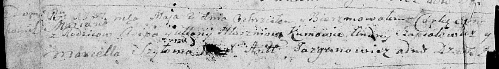

**Глушень Марьяна Асипова (Hłuszeń Mariana)**

2 мая 1787 г -- крещение (НИАБ 136-13-894, лист 1об, №17/1787-р (ориг).

Лист 1об. **Метрическая запись №17/1787-р (ориг).**

Дедиловичская Покровская церковь. 2 мая 1787 года. Метрическая запись о
крещении.

Hłuszńiowna Mariana -- дочь родителей с деревни Домашковичи.

Hłuszeń Asip -- отец.

Hłuszńiowa Ullana -- мать.

Szapialewicz Andrey - кум.

Szyłowa Marcella - кума.

Jazgunowicz Antoniusz -- ксёндз.
