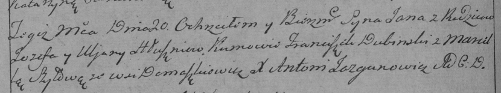

**Глушень Фрузына Асипова (Hłuszniowna Fruzyna)**

25 сентября 1782г -- крещение (РГИА 823-2-18, лист 222об, №6/1782-р
(коп)).

**РГИА 823-2-18:** Лист 222об. **Метрическая запись №6/1782-р (коп).**

{width="6.496527777777778in"
height="1.6708333333333334in"}

Дедиловичская униатская церковь. 25 сентября 1782 года. Метрическая
запись о крещении.

Hłuszniowna Fruzyna -- дочь родителей с деревни Домашковичи.

Hłuszeń Osip -- отец.

Hłuszniowa Uljana -- мать.

Szapielewicz Andrzey -- кум.

Szyłonka Marjanna - кума.

Jazgunowicz Antoni -- ксёндз.
