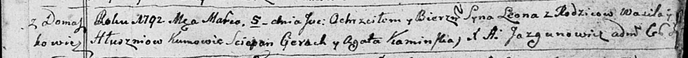

**Глушень Василь (Hłuszeń Wasil)**

5 марта 1792 г -- крещение сына Леона (НИАБ 136-13-894, лист 15,
№10/1792-р (ориг).

**НИАБ 136-13-894:** Лист 15. **Метрическая запись №10/1792-р (ориг).**

Дедиловичская Покровская церковь. 5 марта 1792 года. Метрическая запись
о крещении.

Hłuszen Leon -- сын родителей с деревни Домашковичи.

Hłuszen Wasil -- отец.

Hłuszniowa -- мать.

Cierach Sciepan -- кум.

Kaminska Agata - кума.

Jazgunowicz Antoni -- ксёндз.
