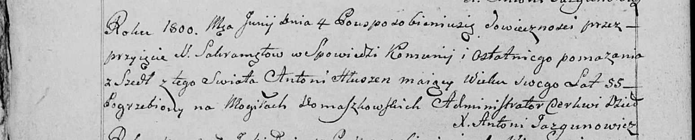

**Глушень Антон (Hłuszeń Antoni)**

4 июня 1800 г -- отпевание, умер в возрасте 55 лет (родился около 1745
г) (НИАБ 136-13-919, лист 10, №14/1800-у (ориг), НИАБ 136-13-949, лист
105об, №13/1800-у (коп)).

**НИАБ 136-13-919:** Лист 10. **Метрическая запись №13/1800-у (ориг).**

{width="6.496527777777778in"
height="1.6645833333333333in"}

Дедиловичская Покровская церковь. 4 июня 1800 года. Метрическая запись
об отпевании.

Hłuszeń Antoni -- умерший, 55 лет, с деревни Домашковичи, похоронен на
кладбище деревни Домашковичи.

Jazgunowicz Antoni -- ксёндз.

**НИАБ 136-13-949:** Лист 105об. **Метрическая запись №13/1800-у
(коп).**

(См. тж.: НИАБ 136-13-919, лист 10, №14/1800-у (ориг))

{width="6.496527777777778in"
height="1.3138888888888889in"}

Дедиловичская Покровская церковь. 4 июня 1800 года. Метрическая запись
об отпевании.

Hłuszeń Antoni -- умерший, 55 лет, с деревни \[Домашковичи\], похоронен
на кладбище деревни Домашковичи.

Jazgunowicz Antoni -- ксёндз.
