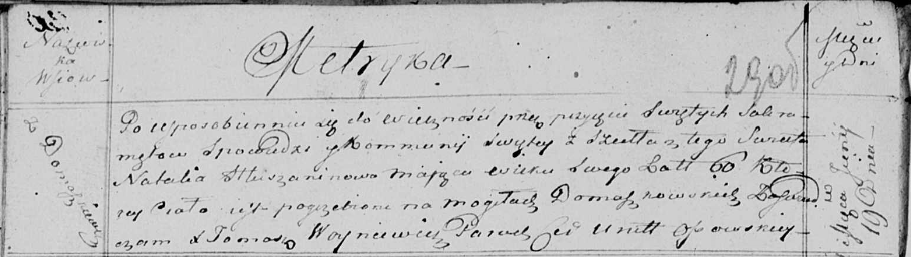

**Глушень Наталья (Hłuszaninowa Natalia)**

19 июня 1815 г -- отпевание, умерла в возрасте 60 лет (родилась около
1755 г) (НИАБ 136-13-919, лист 29об, №19/1815-у (ориг)).

**НИАБ 136-13-919:** Лист 29об. **Метрическая запись №19/1815-у
(ориг).**

{width="6.496527777777778in"
height="1.8388888888888888in"}

Осовская униатская церковь. 19 июня 1815 года. Метрическая запись об
отпевании.

Hłuszaninowa Natalia -- умершая, 60 лет, с деревни Домашковичи,
похоронена на кладбище деревни Домашковичи.

Woyniewicz Tomasz -- ксёндз.
