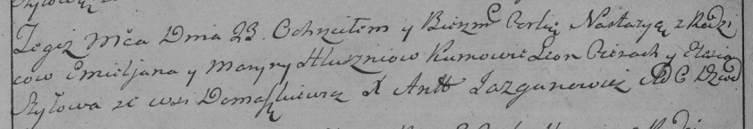

**Глушень Марына (Hłuszniowa Maryna)**

23 июня 1788 г -- крещение дочери Настасьи (НИАБ 136-13-894, лист 4об,
№34/1788-р (ориг), (РГИА 823-2-18, лист 236об, №18/1788-р (коп)).

**НИАБ 136-13-894:** Лист 4-об. **Метрическая запись №34/1788-р
(ориг).**

{width="6.496527777777778in"
height="1.0198392388451443in"}

Дедиловичская Покровская церковь. 23 июня 1788 года. Метрическая запись
о крещении.

Hłuszńiowna Nastazya -- дочь родителей с деревни Домашковичи.

Hłuszeń Emilian-- отец.

Hłuszńiowa Maryna -- мать.

Cierach Leon - кум.

Szyłowa Elesia - кума.

Jazgunowicz Antoni -- ксёндз.

**РГИА 823-2-18:** Лист 236об. **Метрическая запись №18/1788-р (коп).**

{width="6.496527777777778in"
height="1.11875in"}

Дедиловичская Покровская церковь. 23 июня 1788 года. Метрическая запись
о крещении.

Hłuszniowna Nastazya -- дочь родителей с деревни Домашковичи.

Hłuszeń Emieljan -- отец.

Hłuszniowa Maryna -- мать.

Cierach Leon -- кум.

Szyłowa Elesia - кума.

Jazgunowicz Antoni -- ксёндз.
