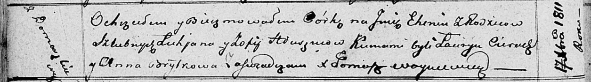

**Глушень Лукьян (Hłuszeń Łukjan)**

17 декабря 1811 г -- крещение дочери Евгении? (НИАБ 136-13-894, лист
55об, №53/1804-р (ориг).

**НИАБ 136-13-894:** Лист 82об. **Метрическая запись №64/1811-р
(ориг).**

{width="6.496527777777778in"
height="0.9058530183727034in"}

Осовская Покровская церковь. 17 декабря 1811 года. Метрическая запись о
крещении.

Hłuszniowna Euhenija? -- дочь родителей с деревни Домашковичи.

Hłuszen Łukjan -- отец.

Hłuszniowa Zofija -- мать.

Cierach Łauryn -- кум.

Brytkowa Anna -- кума.

Woyniewicz Tomasz -- ксёндз.
