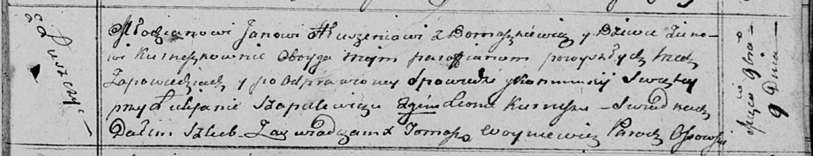

**Глушень Адам Янов (Hłuszаń Adam)**

5 октября 1817 г -- крещение (НИАБ 136-13-894, лист 97об, №59/1817-р
(ориг).

**НИАБ 136-13-894:** Лист 97об. **Метрическая запись №59/1817-р
(ориг).**

{width="6.496527777777778in"
height="0.99167760279965in"}

Осовская Покровская церковь. 5 октября 1817 года. Метрическая запись о
крещении.

Hłuszań Adam -- сын родителей с деревни Домашковичи.

Hłuszniowna Ewa -- дочь родителей с деревни Домашковичи.

Hłuszań Jan -- отец.

Hłuszniowna Zienowija -- мать.

Saulski Franciszek -- кум.

Cierachowa Marta -- кума.

Szapielewicz Łukjan -- кум.

Szapielewiczowa Marcela -- кума.

Woyniewicz Tomasz -- ксёндз.
