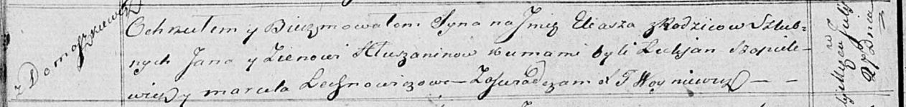

**Глушень Ян (Hłuszаń, Hłuszanin Jan)**

9 ноября 1813 г -- венчание с девкой Зеновией Курнеш с деревни Лустичи
(НИАБ 136-13-920, лист 20, №21/1813-б (ориг).

5 октября 1817 г -- крещение сына Адама и дочери Евы (НИАБ 136-13-894,
лист 97об, №59/1817-р (ориг).

27 июля 1819 г -- крещение сына Ильи (НИАБ 136-13-894, лист 101об,
№40/1819-р (ориг).

**НИАБ 136-13-920:** Лист 20. **Метрическая запись №21/1813-б (ориг).**

{width="6.496527777777778in"
height="1.2518339895013124in"}

Осовская Покровская церковь. 9 ноября 1813 года. Запись о венчании.

Hłuszeń Jan -- жених, молодой, парафии Осовской, с деревни Домашковичи.

Kurneszkowna Zienowija -- невеста, девка, парафии Осовской, с деревни
Лустичи.

Szapielewicz Łukjan -- свидетель.

Kurnesz Leon -- свидетель.

Woyniewicz Tomasz -- ксёндз.

**НИАБ 136-13-894:** Лист 97об. **Метрическая запись №59/1817-р
(ориг).**

{width="6.496527777777778in"
height="0.99167760279965in"}

Осовская Покровская церковь. 5 октября 1817 года. Метрическая запись о
крещении.

Hłuszań Adam -- сын родителей с деревни Домашковичи.

Hłuszniowna Ewa -- дочь родителей с деревни Домашковичи.

Hłuszań Jan -- отец.

Hłuszniowna Zienowija -- мать.

Saulski Franciszek -- кум.

Cierachowa Marta -- кума.

Szapielewicz Łukjan -- кум.

Szapielewiczowa Marcela -- кума.

Woyniewicz Tomasz -- ксёндз.

**НИАБ 136-13-894:** Лист 101об. **Метрическая запись №40/1819-р
(ориг).**

{width="6.496527777777778in"
height="0.7771161417322835in"}

Осовская Покровская церковь. 27 июля 1819 года. Метрическая запись о
крещении.

Hłuszanin Eliasz -- сын родителей с деревни Домашковичи.

Hłuszanin Jan -- отец.

Hłuszaninowa Zienowia -- мать.

Szapielewicz Łukjan -- кум.

Lechnowiczowa Marcela -- кума.

Woyniewicz Tomasz -- ксёндз.
