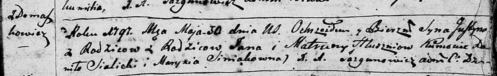

**Глушень (Зыз) Матруна (Hłuszeniowa Matruna, Matrona z Zyzow)**

30 января 1792 г -- венчание с Яном Глушнем с деревни Домашковичи (НИАБ
136-13-894, лист 70об, №4/1792-б (ориг).

11 ноября 1794 г -- крещение дочери Елисаветы (НИАБ 136-13-894, лист 23,
№53/1794-р (ориг).

30 мая 1797 г -- крещение сына Юстына (НИАБ 136-13-894, лист 33,
№34/1797-р (ориг), (РГИА 823-2-18, лист 259об, №24/1797-р (коп)).

28 марта 1800 г -- крещение дочери Христины (НИАБ 937-4-32, лист 1,
№10/1800-р).

26 ноября 1802 г -- крещение сына Георгия (НИАБ 937-4-32, лист 8,
№40/1802-р).

23 января 1805 г -- крещение дочери Текли Татьяны (НИАБ 136-13-894, лист
56об, №9/1805-р (ориг).

19 августа 1806 г -- крещение дочери Магдалены (НИАБ 136-13-894, лист
61, №38/1806-р (ориг).

**НИАБ 136-13-894:** Лист 70об. **Метрическая запись №4/1792-б (ориг).**

{width="6.496527777777778in"
height="1.3839238845144357in"}

Дедиловичская Покровская церковь. 30 января 1792 года. Метрическая
запись о венчании.

Hłuszeń Jan -- жених, с деревни Домашковичи.

Zyzowna Matruna -- невеста.

Suszkiewicz Filip -- свидетель.

Szyło Jan -- свидетель.

Jazgunowicz Antoni -- ксёндз.

**НИАБ 136-13-894:** Лист 23. **Метрическая запись №53/1794-р (ориг).**

{width="6.496527777777778in"
height="0.988996062992126in"}

Дедиловичская Покровская церковь. 11 ноября 1794 года. Метрическая
запись о крещении.

Hłuszniowna Elżbieta -- дочь родителей с деревни Домашковичи.

Hłuszeń Jan -- отец.

Hłuszniowa Matruna -- мать.

Sialicki Daniło - кум.

Huzniakowa Nasta - кума.

Jazgunowicz Antoni -- ксёндз.

**НИАБ 136-13-894:** Лист 33. **Метрическая запись №34/1797-р (ориг).**

{width="6.496527777777778in"
height="1.003746719160105in"}

Дедиловичская Покровская церковь. 30 мая 1797 года. Метрическая запись о
крещении.

Hłuszeń Justyn -- сын родителей с деревни Домашковичи.

Hłuszeń Jan -- отец.

Hłuszniowa Matruna -- мать.

Sialicki Danilo - кум.

Siniakowna Marysia - кума.

Jazgunowicz Antoni -- ксёндз.

**РГИА 823-2-18:** Лист 259об. **Метрическая запись №24/1797-р (коп).**

{width="6.496527777777778in"
height="1.7972222222222223in"}

Дедиловичская Покровская церковь. 31 мая 1797 года. Метрическая запись о
крещении.

Hłuszeń Justyn -- сын родителей с деревни \[Домашковичи\].

Hłuszeń Jan -- отец.

Hłuszniowa Matruna -- мать.

Sialicki Daniło -- кум.

Siniakowna Marysia -- кума.

Jazgunowicz Antoni -- ксёндз.

**НИАБ 937-4-32:** Лист 1. **Метрическая запись №10/1800-р.**

{width="6.496527777777778in"
height="0.5715277777777777in"}

Дедиловичский костел Наисвятейшего Сердца Иисуса. 28 марта 1800 года.
Метрическая запись о крещении.

Hłuszowna Christina -- дочь крестьян с деревни \[Домашковичи\].

Hłusza Joann -- отец.

Hłuszowa Matrona -- мать.

Sielecki Daniel -- крестный отец.

Horawiczowa Nasta -- крестная мать.

Linhart Hyacinthus -- ксёндз.

**НИАБ 937-4-32:** Лист 8. **Метрическая запись №40/1802-р.**

{width="6.496527777777778in"
height="0.94375in"}

Дедиловичский костел Наисвятейшего Сердца Иисуса. 26 ноября 1802 года.
Метрическая запись о крещении.

Hłuszen Georgi -- сын родителей с деревни Домашковичи.

Hłuszen Joann -- отец.

Hłuszniowa Matrona -- мать.

Selicki Daniel -- крестный отец.

Horauczycha Anastasia -- крестная мать, с деревни Домашковичи.

Linhart Hyacinthus -- ксёндз.

**НИАБ 136-13-894:** Лист 56об. **Метрическая запись №9/1805-р (ориг).**

{width="6.496527777777778in"
height="1.1318132108486438in"}

Дедиловичская Покровская церковь. 23 января 1805 года. Метрическая
запись о крещении.

Hłuszniowna Tekla Taciana -- дочь родителей с деревни Домашковичи.

Hłuszeń Janka -- отец.

Hłuszniowa Matruna -- мать.

Sialicki Anania -- кум.

Harawczykowa Nastazya -- кума, с деревни Отруб.

Jazgunowicz Antoni -- ксёндз.

**НИАБ 136-13-894:** Лист 61. **Метрическая запись №38/1806-р (ориг).**

{width="6.496527777777778in"
height="0.9635159667541557in"}

Дедиловичская Покровская церковь. 19 августа 1806 года. Метрическая
запись о крещении.

Hłuszniowna Magdalena -- дочь родителей с деревни Домашковичи.

Hłuszeń Jan -- отец.

Hłuszniowa Matruna -- мать.

Sielicki Anania -- кум.

Harawczykowa Nasta -- кума.

Jazgunowicz Antoni -- ксёндз.
