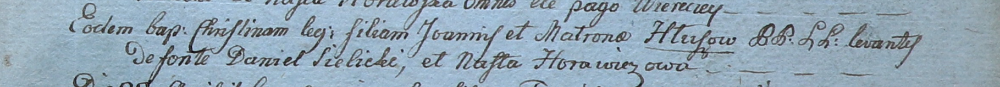

**Глушень Христина Янова (Hłuszeniowna Christina)**

28 марта 1800 г -- крещение дочери Христины (НИАБ 937-4-32, лист 1,
№10/1800-р).

**НИАБ 937-4-32:** Лист 1. **Метрическая запись №10/1800-р.**

Дедиловичский костел Наисвятейшего Сердца Иисуса. 28 марта 1800 года.
Метрическая запись о крещении.

Hłuszowna Christina -- дочь крестьян с деревни \[Домашковичи\].

Hłusza Joann -- отец.

Hłuszowa Matrona -- мать.

Sielecki Daniel -- крестный отец.

Horawiczowa Nasta -- крестная мать.

Linhart Hyacinthus -- ксёндз.
