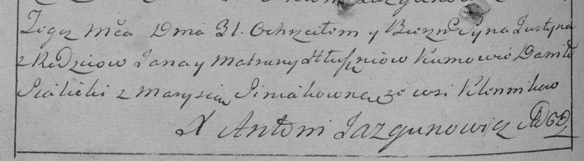

**Глушень Юстын Янов (Hłuszeń Justyn)**

30 мая 1797 г -- крещение (НИАБ 136-13-894, лист 33, №34/1797-р (ориг),
(РГИА 823-2-18, лист 259об, №24/1797-р (коп)).

Лист 33. **Метрическая запись №34/1797-р (ориг).**

Дедиловичская Покровская церковь. 30 мая 1797 года. Метрическая запись о
крещении.

Hłuszeń Justyn -- сын родителей с деревни Домашковичи.

Hłuszeń Jan -- отец.

Hłuszniowa Matruna -- мать.

Sialicki Danilo - кум.

Siniakowna Marysia - кума.

Jazgunowicz Antoni -- ксёндз.

**РГИА 823-2-18:** Лист 259об. **Метрическая запись №24/1797-р (коп).**

Дедиловичская Покровская церковь. 31 мая 1797 года. Метрическая запись о
крещении.

Hłuszeń Justyn -- сын родителей с деревни \[Домашковичи\].

Hłuszeń Jan -- отец.

Hłuszniowa Matruna -- мать.

Sialicki Daniło -- кум.

Siniakowna Marysia -- кума.

Jazgunowicz Antoni -- ксёндз.
