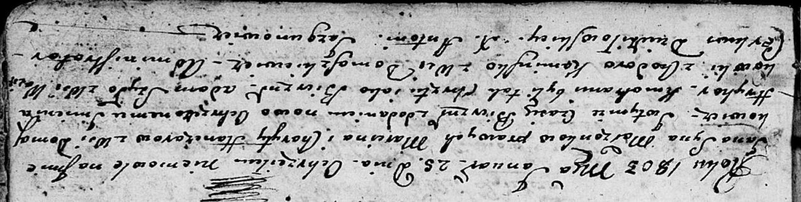

**Гончар Харыта (Hanczarowa Charyta)**

6 июля 1796 г -- крещение сына Козмы (НИАБ 136-13-894, лист 30,
№64/1796-р (ориг), (РГИА 823-2-18, лист 256об, №35/1796-р (коп)).

25 января 1803 г -- крещение сына Яна Грыгора (НИАБ 136-13-894, лист 49,
№2/1803-р (ориг).

**НИАБ 136-13-894:** Лист 30. **Метрическая запись №64/1796-р (ориг).**

{width="6.496527777777778in"
height="1.1103576115485565in"}

Дедиловичская Покровская церковь. 6 июля 1796 года. Метрическая запись о
крещении.

Hanczar Koźma -- сын родителей с деревни Домашковичи.

Hanczar Marcin -- отец.

Hanczarowa Charyta -- мать.

S\[zy\]dłowski Jan - кум.

Woyciechowiczowa Chwiedora - кума.

Jazgunowicz Antoni -- ксёндз.

**РГИА 823-2-18:** Лист 256об. **Метрическая запись №35/1796-р (коп).**

{width="6.496527777777778in"
height="1.9409722222222223in"}

Дедиловичская Покровская церковь. 6 июля 1796 года. Метрическая запись о
крещении.

Honczar Kozma -- сын родителей с деревни Домашковичи.

Honczar Marcin -- отец.

Honczarowa Charyta -- мать.

Szydłowski Jan -- кум.

Woyciechowiczowa Chwiedora -- кума.

Jazgunowicz Antoni -- ксёндз.

**НИАБ 136-13-894:** Лист 49. **Метрическая запись №2/1803-р (ориг).**

{width="6.496527777777778in"
height="1.646091426071741in"}

Дедиловичская Покровская церковь. 25 января 1803 года. Метрическая
запись о крещении.

Hanczar Jan Hryhor -- сын родителей с деревни Домашковичи.

Hanczar Marcin -- отец.

Hanczarowa Charyta -- мать.

Szyło Adam -- кум, с деревни Васильковка.

Kaminska Chodora -- кума, с деревни Домашковичи.

Jazgunowicz Antoni -- ксёндз.
