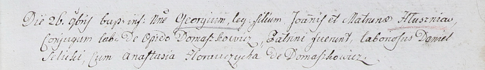
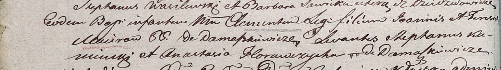

**Горавчик Анастасия (Horauczycha Anastasia)**

26 ноября 1802 г -- крестная мать Георгия, сына Яна и Матруны Глушнёв с
деревни Домашковичи (НИАБ 937-4-32, лист 8, №40/1802-р).

21 ноября 1804 г -- крестная мать Клементия, сына Иоанна и Терезии
Мациров с деревни Домашковичи (НИАБ 937-4-32, лист 10об, №24/1804-р).

**НИАБ 937-4-32:** Лист 8. **Метрическая запись №40/1802-р.**

Дедиловичский костел Наисвятейшего Сердца Иисуса. 26 ноября 1802 года.
Метрическая запись о крещении.

Hłuszen Georgi -- сын родителей с деревни Домашковичи.

Hłuszen Joann -- отец.

Hłuszniowa Matrona -- мать.

Selicki Daniel -- крестный отец.

Horauczycha Anastasia -- крестная мать, с деревни Домашковичи.

Linhart Hyacinthus -- ксёндз.

**НИАБ 937-4-32:** Лист 10об. **Метрическая запись №24/1804-р.**

Дедиловичский костел Наисвятейшего Сердца Иисуса. 21 ноября 1804 года.
Метрическая запись о крещении.

Maciro Clementis -- сын крестьян с деревни Домашковичи.

Maciro Joann -- отец.

Macirowao Teresia -- мать.

Kaminski Stephan -- крестный отец.

Horauczycha Anastasia -- крестная мать, с деревни Домашковичи.

Galinowski Joann -- ксёндз, комендант Дедиловичского костела.
