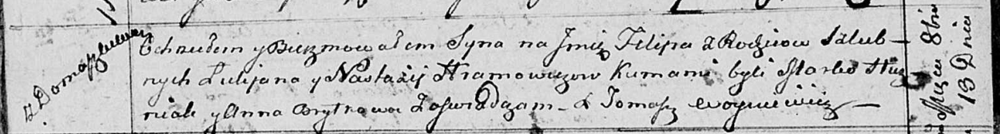

**Громович Лукьян (Hromowicz Łukjan)**

13 октября 1813 г -- крещение сына Филипа (НИАБ 136-13-894, лист 87об,
№31/1813-р (ориг)).

**НИАБ 136-13-894:** Лист 87об. **Метрическая запись №31/1813-р
(ориг).**

{width="6.496527777777778in"
height="0.8716568241469816in"}

Осовская Покровская церковь. 13 октября 1813 года. Метрическая запись о
крещении.

Hramowicz Filip -- сын родителей с деревни Домашковичи.

Hramowicz Łukjan -- отец.

Hramowiczowa Nastazyja -- мать.

Huzniak Marko -- кум.

Brytkowa Anna -- кума.

Woyniewicz Tomasz -- ксёндз.
