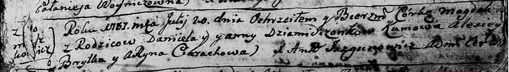

**Демидчёнок Магдалена Данилова (Dziamidczonkowna Magdalena)**

20 июля 1787 г -- крещение (НИАБ 136-13-894, лист 2, №35/1787-р (ориг).

**РГИА 823-2-18:** Лист 2. **Метрическая запись №35/1787-р (ориг).**

{width="6.496527777777778in"
height="0.9273086176727909in"}

Дедиловичская Покровская церковь. 20 июля 1787 года. Метрическая запись
о крещении.

Dziamidczonkowna Magdalena -- дочь родителей с деревни Домашковичи.

Dziamidczonak Daniel -- отец.

Dziamidczonkowa Anna -- мать.

Brytka Alexiey -- кум.

Cierachowa Aryna - кума.

Jazgunowicz Antoniusz -- ксёндз.
