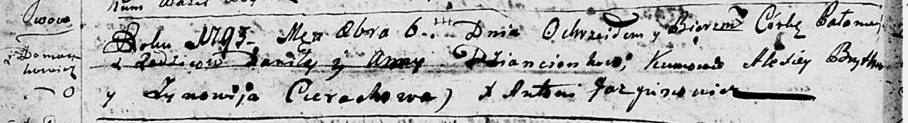

**Дентёнок Паланея Данилова (Dzioncionkowna Pałanieja)**

6 октября 1793 г -- крещение (НИАБ 136-13-894, лист 20об, №69/1793-р
(ориг).

**НИАБ 136-13-894:** Лист 20-об. **Метрическая запись №69/1793-р
(ориг).**

Дедиловичская Покровская церковь. 6 октября 1793 года. Метрическая
запись о крещении.

Dzioncionkowna Pałanieja -- дочь родителей с деревни Домашковичи.

Dzioncionak Daniła -- отец.

Dzioncionkowa Anna-- мать.

Brytka Aliexiey - кум.

Cierachowa Zynowija - кума.

Jazgunowicz Antoni -- ксёндз.
