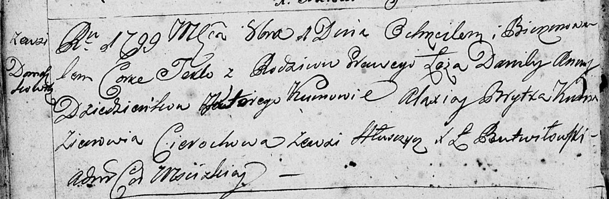
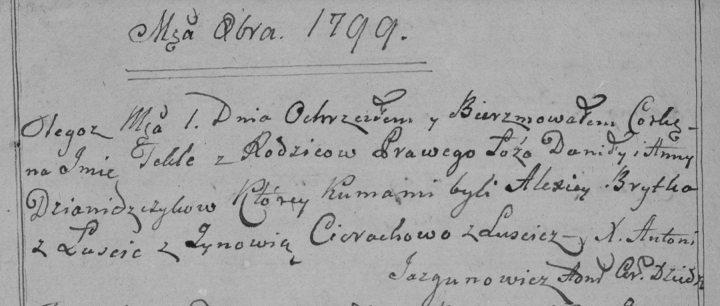

**Дентёнок Текля Данилова (Dziendzeńkowna Tekla)**

1 октября 1799 г -- крещение (НИАБ 136-13-894, лист 39об, №39/1799-р
(ориг), (РГИА 823-2-18, лист 272об, №38/1799-р (коп)).

**НИАБ 136-13-894:** Лист 39об. **Метрическая запись №39/1799-р
(ориг).**

Дедиловичская Покровская церковь. 1 октября 1799 года. Метрическая
запись о крещении.

Dziedzeńkowna Tekla -- дочь родителей с деревни Домашковичи.

Dziedzeńok Daniła -- отец.

Dziedzeńkowa Anna -- мать.

Brytka Alaxiey -- кум.

Cierachowa Zienowia -- кума с деревни \[Лустичи\].

Jazgunowicz Antoni -- ксёндз.

**РГИА 823-2-18:** Лист 272об. **Метрическая запись №38/1799-р (коп).**

Дедиловичская Покровская церковь. 1 октября 1799 года. Метрическая
запись о крещении.

Dziamidczykowna \[Dziedzeńkowna\] Tekla -- дочь.

Dziamidczyk \[Dziedzenok\] Daniło -- отец.

Dziamidczykowa \[Dziedzeńkowa\] Anna -- мать.

Brytko Alexiey -- кум, с деревни Лустичи.

Cierachowa Zynowia -- кума, деревни Лустичи.

Jazgunowicz Antoni -- ксёндз.
