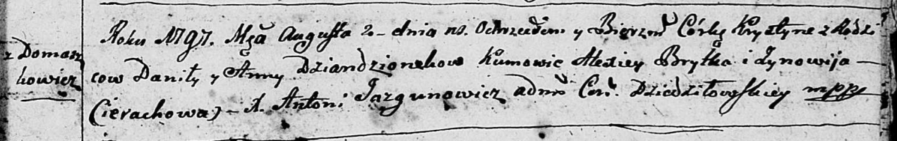
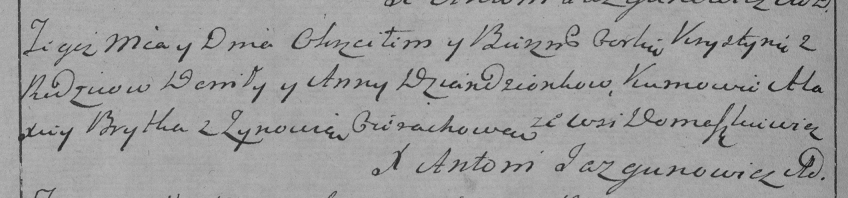

**Дентёнок Хрыстына Данилова (Dzioncionkowna Krystyna)**

2 августа 1797 г -- крещение (НИАБ 136-13-894, лист 50, №50/1797-р
(ориг), (РГИА 823-2-18, лист 260об, №34/1797-р (коп)).

**НИАБ 136-13-894:** Лист 34. **Метрическая запись №50/1797-р (ориг).**

Дедиловичская Покровская церковь. 2 августа 1797 года. Метрическая
запись о крещении.

Dziandzionkowna Krystyna -- дочь родителей с деревни Домашковичи.

Dziandzionek Daniła -- отец.

Dziandzionkowa Anna -- мать.

Brytko Alexiey - кум.

Cierachowa Zynowija - кума.

Jazgunowicz Antoni -- ксёндз.

**РГИА 823-2-18:** Лист 260об. **Метрическая запись №34/1797-р (коп).**

Дедиловичская Покровская церковь. 2 августа 1797 года. Метрическая
запись о крещении.

Dziandzionkowna Krystyna -- дочь родителей с деревни Домашковичи.

Dziandzionek Daniło -- отец.

Dziandzionkowa Anna -- мать.

Brytka Alaxiey -- кум.

Cierachowa Zynowia -- кума.

Jazgunowicz Antoni -- ксёндз.
