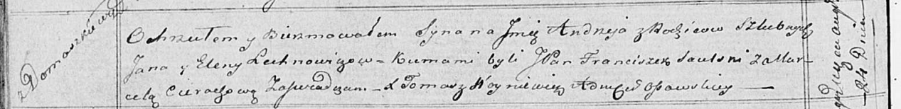

**Елехнович, Лехнович Андрей Янов (Lechnowicz Andrzey)**

24 августа 1819 г -- крещение (НИАБ 136-13-894, лист 101об, №44/1819-р
(ориг)).

**НИАБ 136-13-894:** Лист 101об. **Метрическая запись №44/1819-р
(ориг).**

Осовская Покровская церковь. 24 августа 1819 года. Метрическая запись о
крещении.

Lechnowicz Andrzey -- сын родителей с деревни Домашковичи.

Lechnowicz Jan -- отец.

Lechnowiczowa Elena -- мать.

Saulski Franciszek, JP -- кум, шляхтич.

Cierachowa Marcela -- кума.

Woyniewicz Tomasz -- ксёндз.
