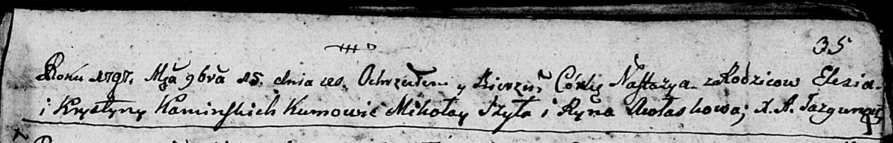
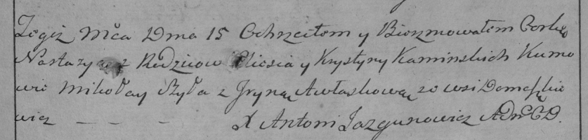
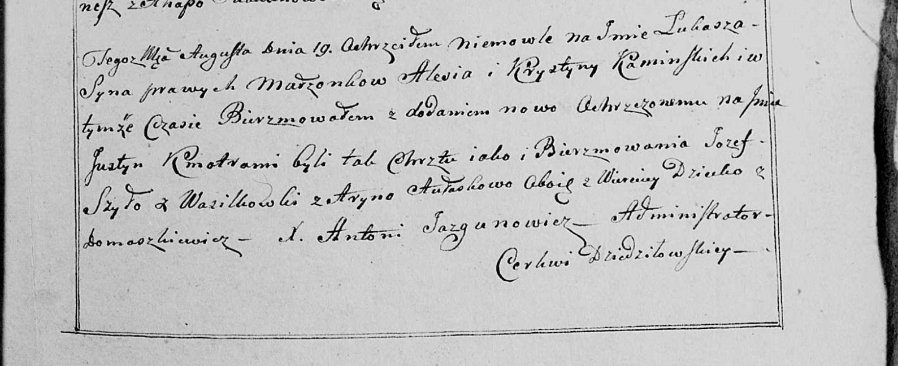

**Каминский Алесь (Kaminski Aleś)**

15 ноября 1797 г -- крещение дочери Настасьи (НИАБ 136-13-894, лист 35,
№65/1797-р (ориг)), (РГИА 823-2-18, лист 261, №46/1797-р (коп)).

19 августа 1800 г -- крещение сына Лукаша Юстына (НИАБ 136-13-949, лист
103, №25/1800-р (коп).

**НИАБ 136-13-894:** Лист 35. **Метрическая запись №65/1797-р (ориг).**

Дедиловичская Покровская церковь. 15 ноября 1797 года. Метрическая
запись о крещении.

Kaminska Nastazya -- дочь \[родителей с деревни Домашковичи\].

Kaminski Eleś -- отец.

Kaminska Krystyna -- мать.

Szyło Mikolay - кум.

Awłaskowa Ryna - кума.

Jazgunowicz Antoni -- ксёндз.

**РГИА 823-2-18:** Лист 261. **Метрическая запись №46/1797-р (коп).**

Дедиловичская Покровская церковь. 15 ноября 1797 года. Метрическая
запись о крещении.

Kaminska Nastazya -- дочь родителей с деревни Домашковичи.

Kaminski Aleś -- отец.

Kaminska Krystyna -- мать.

Szyła Mikołay -- кум.

Awłaskowa Jryna -- кума.

Jazgunowicz Antoni -- ксёндз.

**НИАБ 136-13-949:** Лист 103. **Метрическая запись №25/1800-р (коп).**

(См. тж.: РГИА 823-2-18, лист 276об, №17/1800-р (коп)

Дедиловичская Покровская церковь. 19 августа 1800 года. Метрическая
запись о крещении.

Kaminski Łukasz Justyn -- сын родителей с деревни Домашковичи.

Kaminski Aleś -- отец.

Kaminska Krystyna -- мать.

Szyło Jozef -- кум, с деревни Васильковка.

Aułaskowa Aryna - кума, с деревни Веретей.

Jazgunowicz Antoni -- ксёндз.
