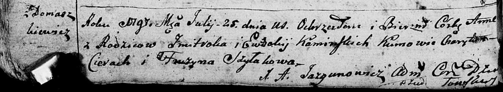
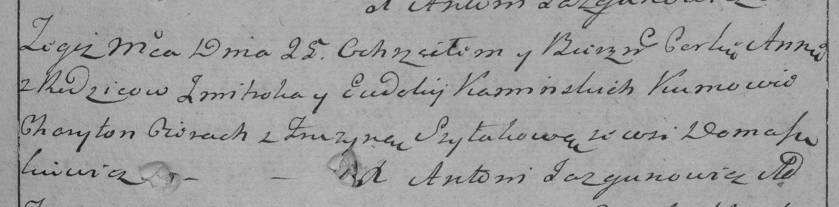

**Каминская Анна Змитрокова (Kaminska Anna)**

25 июля 1797 г -- крещение (НИАБ 136-13-894, лист 33об, №46/1797-р
(ориг)), (РГИА 823-2-18, лист 260, №31/1797-р (коп)).

**НИАБ 136-13-894:** Лист 33об. **Метрическая запись №46/1797-р
(ориг).**

Дедиловичская Покровская церковь. 25 июля 1797 года. Метрическая запись
о крещении.

Kaminska Anna -- дочь родителей с деревни Домашковичи.

Kaminski Zmitrok -- отец.

Kaminska Ewdokija -- мать.

Cierach Charyton - кум.

Szyłakowa Fruzyna - кума.

Jazgunowicz Antoni -- ксёндз.

**РГИА 823-2-18:** Лист 260. **Метрическая запись №31/1797-р (коп).**

Дедиловичская Покровская церковь. 25 июля 1797 года. Метрическая запись
о крещении.

Kaminska Anna -- дочь родителей с деревни Домашковичи.

Kaminski Zmitrok -- отец.

Kaminska Eudokija -- мать.

Cierach Charyton -- кум.

Szyłakowa Fruzyna -- кума.

Jazgunowicz Antoni -- ксёндз.
