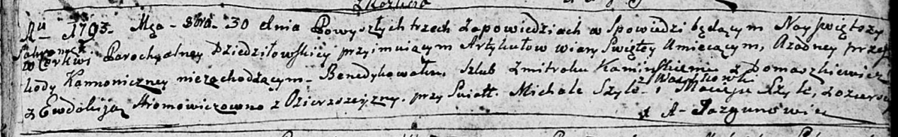
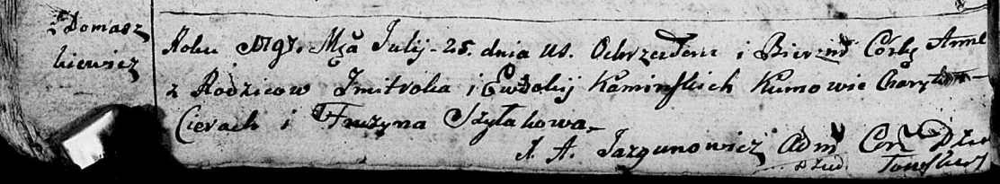
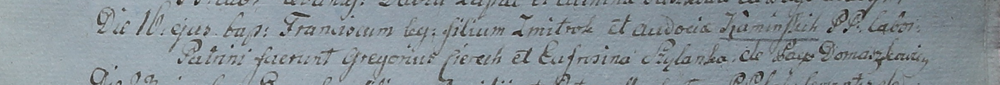
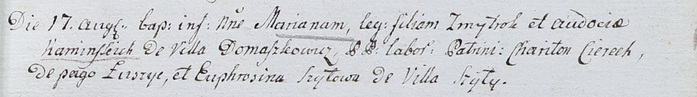

**Каминская (Хромович) Евдокия (Kaminska Ewdokija, Audocia z
Hromowiczow)**

30 октября 1793 г -- венчание с Каминским Змитроком с деревни
Домашковичи (НИАБ 136-13-894, лист 72, №5/1793-б (ориг)).

9 марта 1795 г -- крещение сына Павла (НИАБ 136-13-894, лист 24,
№5/1795-р (ориг)), (РГИА 823-2-18, лист 252, №5/1795-р (коп)).

25 июля 1797 г -- крещение дочери Анны (НИАБ 136-13-894, лист 33об,
№46/1797-р (ориг)), (РГИА 823-2-18, лист 260, №31/1797-р (коп)).

16 октября 1799 г -- крещение сына Франциска (НИАБ 1781-27-199, лист
129, №45/1799-р).

17 августа 1802 г -- крещение дочери Марьяны (НИАБ 937-4-32, лист 7,
№23/1802-р).

23 января 1805 г -- крещение дочери Паланеи Зоси (НИАБ 136-13-894, лист
56об, №11/1805-р (ориг)).

**НИАБ 136-13-894:** Лист 72. **Метрическая запись №5/1793-б (ориг).**

Дедиловичская Покровская церковь. 30 октября 1793 года. Метрическая
запись о венчании.

Kaminski Zmitrok -- жених, с деревни Домашковичи.

Hromowiczowna Ewdokija -- невеста, с деревни Озерщизна.

Szyło Michał -- свидетель, с деревни Васильковка.

Szyło Maciey -- свидетель, с деревни Озерщизна.

Jazgunowicz Antoni -- ксёндз.

**НИАБ 136-13-894:** Лист 24. **Метрическая запись №5/1795-р (ориг).**

Дедиловичская Покровская церковь. 9 марта 1795 года. Метрическая запись
о крещении.

Kaminski Paweł -- сын родителей с деревни Домашковичи.

Kaminski Zmitrok -- отец.

Kaminska Ewdokija -- мать.

Cierach Charyton - кум.

Szyłowa Fruzyna - кума.

Jazgunowicz Antoni -- ксёндз.

**РГИА 823-2-18:** Лист 252. **Метрическая запись №5/1795-р (коп).**

Дедиловичская Покровская церковь. 9 марта 1795 года. Метрическая запись
о крещении.

Kaminski Paweł -- сын родителей с деревни Домашковичи.

Kaminski Zmitrok -- отец.

Kaminska Eudokija -- мать.

Cierach Charyton -- кум.

Szyłowa Fruzyna -- кума.

Jazgunowicz Antoni -- ксёндз.

**НИАБ 136-13-894:** Лист 33об. **Метрическая запись №46/1797-р
(ориг).**

Дедиловичская Покровская церковь. 25 июля 1797 года. Метрическая запись
о крещении.

Kaminska Anna -- дочь родителей с деревни Домашковичи.

Kaminski Zmitrok -- отец.

Kaminska Ewdokija -- мать.

Cierach Charyton - кум.

Szyłakowa Fruzyna - кума.

Jazgunowicz Antoni -- ксёндз.

**РГИА 823-2-18:** Лист 260. **Метрическая запись №31/1797-р (коп).**

Дедиловичская Покровская церковь. 25 июля 1797 года. Метрическая запись
о крещении.

Kaminska Anna -- дочь родителей с деревни Домашковичи.

Kaminski Zmitrok -- отец.

Kaminska Eudokija -- мать.

Cierach Charyton -- кум.

Szyłakowa Fruzyna -- кума.

Jazgunowicz Antoni -- ксёндз.

**НИАБ 1781-27-191:** Лист 129. **Метрическая запись №45/1799-р.**

Дедиловичский костел Наисвятейшего Сердца Иисуса. 16 октября 1799 года.
Метрическая запись о крещении.

Kaminski Francisc -- сын крестьян с деревни Домашковичи.

Kaminski Zmitrok -- отец.

Kaminska Audocia -- мать.

Cierech Gregoriusz -- крестный отец.

Szyłanka Eufrosina -- крестная мать.

Linhart Hyacinthus -- ксёндз.

**НИАБ 937-4-32:** Лист 7. **Метрическая запись №23/1802-р.**

Дедиловичский костел Наисвятейшего Сердца Иисуса. 17 августа 1802 года.
Метрическая запись о крещении.

Kaminska Mariana -- дочь крестьян с деревни Домашковичи.

Kaminski Zmytrok -- отец.

Kaminska Audocia -- мать.

Cierech Chariton -- крестный отец, крестьянин, с деревни Лустичи.

Szyłowa Euphrosina -- крестная мать, крестьянка, с деревни Шилы.

Linhart Hyacinthus -- ксёндз.

**НИАБ 136-13-894:** Лист 56об. **Метрическая запись №11/1805-р
(ориг).**

Дедиловичская Покровская церковь. 23 января 1805 года. Метрическая
запись о крещении.

Kaminska Palanieja Zosia -- дочь родителей с деревни Домашкoвичи.

Kaminski Zmitrok -- отец.

Kaminska Ewdokija -- мать.

Cierach Charyton -- кум, с деревни Лустичи.

Szyłowa Katerzyna -- кума, с деревни Домашкoвичи.

Jazgunowicz Antoni -- ксёндз.
