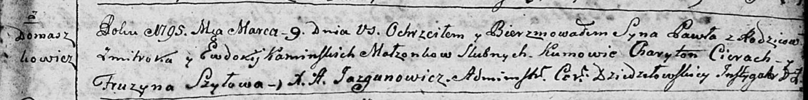

**Каминский Павел Змитроков (Kaminski Paweł)**

9 марта 1795 г -- крещение (НИАБ 136-13-894, лист 24, №5/1795-р (ориг)),
(РГИА 823-2-18, лист 252, №5/1795-р (коп)).

**НИАБ 136-13-894:** Лист 24. **Метрическая запись №5/1795-р (ориг).**

Дедиловичская Покровская церковь. 9 марта 1795 года. Метрическая запись
о крещении.

Kaminski Paweł -- сын родителей с деревни Домашковичи.

Kaminski Zmitrok -- отец.

Kaminska Ewdokija -- мать.

Cierach Charyton - кум.

Szyłowa Fruzyna - кума.

Jazgunowicz Antoni -- ксёндз.

**РГИА 823-2-18:** Лист 252. **Метрическая запись №5/1795-р (коп).**

Дедиловичская Покровская церковь. 9 марта 1795 года. Метрическая запись
о крещении.

Kaminski Paweł -- сын родителей с деревни Домашковичи.

Kaminski Zmitrok -- отец.

Kaminska Eudokija -- мать.

Cierach Charyton -- кум.

Szyłowa Fruzyna -- кума.

Jazgunowicz Antoni -- ксёндз.
