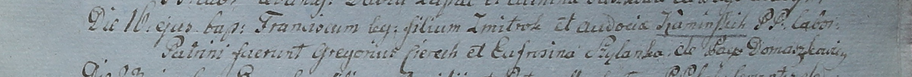

**Каминский Франциск Змитроков (Kaminski Francisc)**

16 октября 1799 г -- крещение (НИАБ 1781-27-199, лист 129, №45/1799-р).

**НИАБ 1781-27-191:** Лист 129. **Метрическая запись №45/1799-р.**

Дедиловичский костел Наисвятейшего Сердца Иисуса. 16 октября 1799 года.
Метрическая запись о крещении.

Kaminski Francisc -- сын крестьян с деревни Домашковичи.

Kaminski Zmitrok -- отец.

Kaminska Audocia -- мать.

Cierech Gregoriusz -- крестный отец.

Szyłanka Eufrosina -- крестная мать.

Linhart Hyacinthus -- ксёндз.
