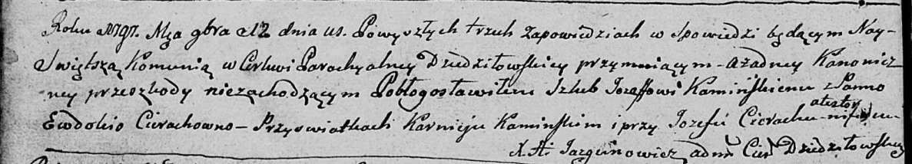
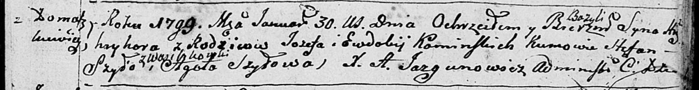
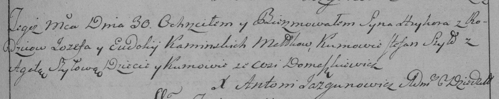
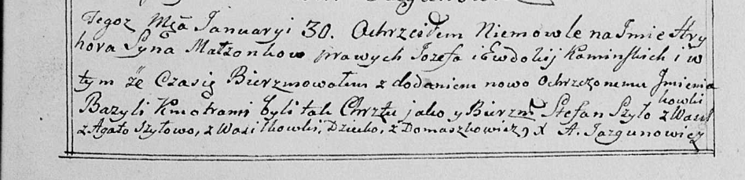

**Каминская (Церах) Евдокия (Kaminska (Cierachowna) Ewdokija, Audocia)**

12 ноября 1797 г -- венчание с Иосифом Каминским с деревни Домашковичи
(НИАБ 136-13-920, лист 4об, №11/1797-б (ориг)).

30 января 1799 г -- крещение сына Грыгора Базылия (НИАБ 136-13-894, лист
38, №4/1799-р (ориг)), (РГИА 823-2-18, лист 268, №4/1799-р (коп), НИАБ
136-13-938, лист 240, №4/1799-р (коп)).

19 мая 1800 г -- крещение дочери Петронели (НИАБ 937-4-32, лист 2,
№2/1800-р).

**НИАБ 136-13-920:** Лист 4об. **Метрическая запись №11/1797-б (ориг).**

Дедиловичская Покровская церковь. 12 ноября 1797 года. Метрическая
запись о венчании.

Kaminski Jozef -- жених с деревни \[Домашковичи\].

Cierachowna Ewdokia -- невеста.

Kaminski Karniey -- свидетель.

Cierach Jozef -- свидетель.

Jazgunowicz Antoni -- ксёндз.

**НИАБ 136-13-894:** Лист 38. **Метрическая запись №4/1799-р (ориг).**

Дедиловичская Покровская церковь. 30 января 1799 года. Метрическая
запись о крещении.

Kaminski Hryhor Bazyli -- сын родителей с деревни Домашковичи.

Kaminski Jozef -- отец.

Kaminska Ewdokija -- мать.

Szyło Stefan -- кум с деревни Васильковка.

Szyłowa Agata -- кума.

Jazgunowicz Antoni -- ксёндз.

**РГИА 823-2-18:** Лист 268. **Метрическая запись №4/1799-р (коп).**

Дедиловичская Покровская церковь. 30 января 1799 года. Метрическая
запись о крещении.

Kaminski Hryhor -- сын родителей с деревни Домашковичи.

Kaminski Jozef -- отец.

Kaminska Eudokija -- мать.

Szyło Stefan -- кум, с деревни Домашковичи \[Васильковка\].

Szyłowa Agata -- кума, с деревни Домашковичи.

Jazgunowicz Antoni -- ксёндз.

**НИАБ 136-13-938:** Лист 240. **Метрическая запись №4/1799-р (коп).**

(См. тж. НИАБ 136-13-894, лист 38, №4/1799-р (ориг); РГИА 823-2-18, лист
268, №4/1799-р (коп))

Дедиловичская Покровская церковь. 30 января 1799 года. Метрическая
запись о крещении.

Kaminski Hryhor Bazyli -- сын родителей с деревни Домашковичи.

Kaminski Jozef -- отец.

Kaminska Ewdokija -- мать.

Szyło Stefan -- кум, с деревни Васильковка.

Szyłowa Agata - кума, с деревни Васильковка.

Jazgunowicz Antoni -- ксёндз.

**НИАБ 937-4-32:** Лист 2. **Метрическая запись №15/1800-р.**

Дедиловичский костел Наисвятейшего Сердца Иисуса. 19 мая 1800 года.
Метрическая запись о крещении.

Kaminska Petronella -- дочь крестьян с деревни Домашковичи.

Kaminski Joseph -- отец.

Kaminska Audocia -- мать.

Szyło Stanisław -- крестный отец.

Szyłowa Agatha -- крестная мать, с деревни Васильковка.

Linhart Hyacinthus -- ксёндз.
