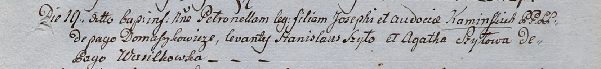

**Каминская Петронеля Иосифова (Kaminska Petronela)**

19 мая 1800 г -- крещение (НИАБ 937-4-32, лист 2, №2/1800-р).

**НИАБ 937-4-32:** Лист 2. **Метрическая запись №15/1800-р.**

Дедиловичский костел Наисвятейшего Сердца Иисуса. 19 мая 1800 года.
Метрическая запись о крещении.

Kaminska Petronella -- дочь крестьян с деревни Домашковичи.

Kaminski Joseph -- отец.

Kaminska Audocia -- мать.

Szyło Stanisław -- крестный отец.

Szyłowa Agatha -- крестная мать, с деревни Васильковка.

Linhart Hyacinthus -- ксёндз.
