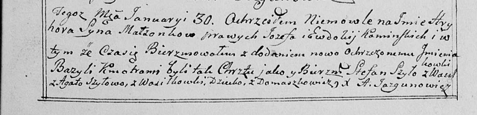

**Каминский Грыгор Иосифов (Kaminski Hryhor Bazyli)**

30 января 1799 г -- крещение (НИАБ 136-13-894, лист 38, №4/1799-р
(ориг)), (РГИА 823-2-18, лист 268, №4/1799-р (коп), НИАБ 136-13-938,
лист 240, №4/1799-р (коп)).

**НИАБ 136-13-894:** Лист 38. **Метрическая запись №4/1799-р (ориг).**

Дедиловичская Покровская церковь. 30 января 1799 года. Метрическая
запись о крещении.

Kaminski Hryhor Bazyli -- сын родителей с деревни Домашковичи.

Kaminski Jozef -- отец.

Kaminska Ewdokija -- мать.

Szyło Stefan -- кум с деревни Васильковка.

Szyłowa Agata -- кума.

Jazgunowicz Antoni -- ксёндз.

**РГИА 823-2-18:** Лист 268. **Метрическая запись №4/1799-р (коп).**

Дедиловичская Покровская церковь. 30 января 1799 года. Метрическая
запись о крещении.

Kaminski Hryhor -- сын родителей с деревни Домашковичи.

Kaminski Jozef -- отец.

Kaminska Eudokija -- мать.

Szyło Stefan -- кум, с деревни Домашковичи \[Васильковка\].

Szyłowa Agata -- кума, с деревни Домашковичи.

Jazgunowicz Antoni -- ксёндз.

**НИАБ 136-13-938:** Лист 240. **Метрическая запись №4/1799-р (коп).**

(См. тж. НИАБ 136-13-894, лист 38, №4/1799-р (ориг); РГИА 823-2-18, лист
268, №4/1799-р (коп))

Дедиловичская Покровская церковь. 30 января 1799 года. Метрическая
запись о крещении.

Kaminski Hryhor Bazyli -- сын родителей с деревни Домашковичи.

Kaminski Jozef -- отец.

Kaminska Ewdokija -- мать.

Szyło Stefan -- кум, с деревни Васильковка.

Szyłowa Agata - кума, с деревни Васильковка.

Jazgunowicz Antoni -- ксёндз.
