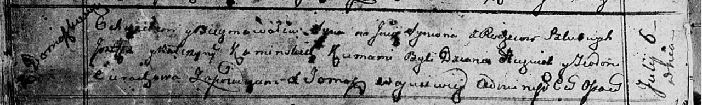

**Каминская Катерына (Kaminska Katerzyna)**

6 апреля 1808 г -- крещение дочери Магдалены Марты (НИАБ 136-13-894,
лист 65, №18/1808-р (ориг)).

6 июля 1813 г -- крещение сына Сымона (НИАБ 136-13-894, лист 86об,
№16/1813-р (ориг)).

2 мая 1811 г -- крещение дочери Катарины (НИАБ 937-4-32, лист 23,
№7/1811-р).

**НИАБ 136-13-894:** Лист 65. **Метрическая запись №18/1808-р (ориг).**

Дедиловичская Покровская церковь. 6 апреля 1808 года. Метрическая запись
о крещении.

Kaminska Magdalena Marta -- дочь родителей с деревни Домашковичи.

Kaminski Jozef -- отец.

Kaminska Katerzyna -- мать.

Huzniak Dzianis -- кум.

Szyłowa Chwiedora -- кума.

Jazgunowicz Antoni -- ксёндз.

**НИАБ 937-4-32:** Лист 23. **Метрическая запись №7/1811-р.**

Дедиловичский костел Наисвятейшего Сердца Иисуса. 2 мая 1811 года.
Метрическая запись о крещении.

Kaminska Catharina -- дочь крестьян с деревни Домашковичи.

Kaminski Joseph -- отец.

Kaminska Catharina -- мать.

Jacuk Joseph -- крестный отец.

Cierachowa Theodora -- крестная мать.

Zychowski Gabriel -- ксёндз.

**НИАБ 136-13-894:** Лист 86об. **Метрическая запись №16/1813-р
(ориг).**

Осовская Покровская церковь. 6 июля 1813 года. Метрическая запись о
крещении.

Kaminski Symon -- сын родителей с деревни Домашковичи.

Kaminski Jozef -- отец.

Kaminska Katerzyna -- мать.

Huzniak Dzianis -- кум.

Cierachowa Teodora -- кума.

Woyniewicz Tomasz -- ксёндз.
