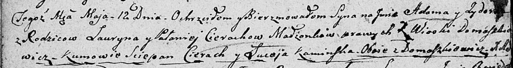

**Каминская Авдотья (Kaminska Audocia)**

24 августа 1802 г -- крестная мать Бартоломея, сына Игнация и Агапы
Брытков с деревни Лустичи (НИАБ 937-4-32, лист 7, №24/1802-р).

**НИАБ 937-4-32:** Лист 7. **Метрическая запись №24/1802-р.**

{width="6.496527777777778in"
height="0.9416666666666667in"}

Дедиловичский костел Наисвятейшего Сердца Иисуса. 24 августа 1802 года.
Метрическая запись о крещении.

Brydko Bartołomiey -- сын крестьян с деревни Лустичи.

Brydko Jgnati -- отец.

Brydkowa Ahapa -- мать.

Kurnesz Joseph -- крестный отец, с деревни Домашковичи.

Kaminska Audocia -- крестная мать, с деревни Домашковичи.

Linhart Hyacinthus -- ксёндз.
