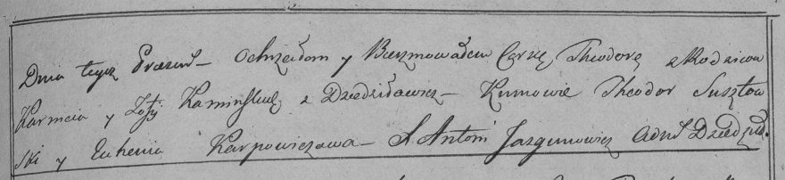

**Каминская Елена Карнеева (Kaminska Elena)**

16 мая 1792 г -- крещение (НИАБ 136-13-894, лист 15об, №25/1792-р
(ориг)).

Лист 15об. **Метрическая запись №25/1792-р (ориг).**

{width="6.496527777777778in"
height="1.107004593175853in"}

Дедиловичская Покровская церковь. 16 мая 1792 года. Метрическая запись о
крещении.

Kaminska Elena -- дочь родителей с деревни Домашковичи.

Kaminski Karnej -- отец, селянин.

Kaminska Zosia -- мать, селянка.

Juszkowski Chwiedor - кум.

Karpowiczowa Euhenija - кума.

Jazgunowicz Antoni -- ксёндз.
