**Каминский Карней (Kaminski Karniej, Korniej)**

2 апреля 1788 г -- крещение сына Марка (НИАБ 136-13-894, лист 4об,
№27/1788-р (ориг)), (РГИА 823-2-18, лист 236, №11/1788-р (коп)).

1 апреля 1791 г -- крещение сына Грыгора (НИАБ 136-13-894, лист 13,
№16/1791-р (ориг)).

16 мая 1792 г -- крещение дочери Елены (НИАБ 136-13-894, лист 15об,
№25/1792-р (ориг)).

17 июля 1793 г -- крещение сына Степана (НИАБ 136-13-894, лист 20,
№55/1793-р (ориг)), (РГИА 823-2-18, лист 248, №29/1793-р (коп)).

25 июля 1795 г -- крещение дочери Анны (НИАБ 136-13-894, лист 24об,
№25/1795-р (ориг)), (РГИА 823-2-18, лист 252об, №20/1795-р (коп)).

9 ноября 1796 г -- свидетель венчания Михала Цераха с деревни Лустичи с
Агапой Шило с деревни Лустичи (НИАБ 136-13-920, лист 3об, №14/1796-б
(ориг)).

24 июня 1798 г -- крещение дочери Тодоры (НИАБ 136-13-894, лист 36об,
№35/1798-р (ориг)), (РГИА 823-2-18, лист 265, №35/1798-р (коп)).

22 февраля 1803 г -- крещение сына Иоанна (НИАБ 937-4-32, лист 9,
№5/1803-р).

2 сентября 1806 г -- крещение дочери Крыстыны (НИАБ 136-13-894, лист 61,
№40/1806-р (ориг)).

**НИАБ 136-13-894:** Лист 4-об. **Метрическая запись №27/1788-р
(ориг).**

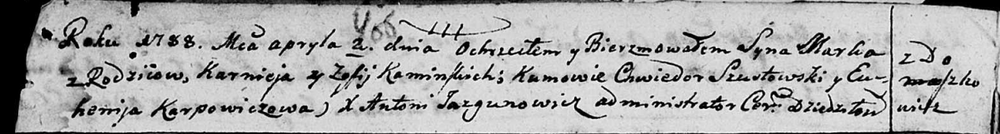

Дедиловичская Покровская церковь. 2 апреля 1788 года. Метрическая запись
о крещении.

Kaminski Marko -- сын родителей с деревни Домашковичи.

Kaminski Karniej -- отец.

Kaminska Zofija -- мать.

Szustowski Chwiedor - кум.

Karpowiczowa Euhenija - кума.

Jazgunowicz Antoniusz -- ксёндз.

**РГИА 823-2-18:** Лист 236. **Метрическая запись №11/1788-р (коп).**

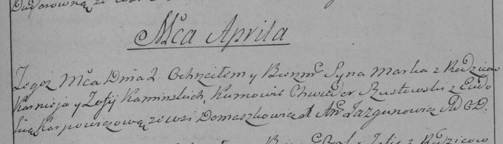

Дедиловичская Покровская церковь. 2 апреля 1788 года. Метрическая запись
о крещении.

Kaminski Marko -- сын родителей с деревни Домашковичи.

Kaminski Karniey -- отец.

Kaminska Zofija -- мать.

Szustowski Chwiedor -- кум.

Karpowiczowa Eudokija - кума.

Jazgunowicz Antoni -- ксёндз.

**НИАБ 136-13-894:** Лист 13. **Метрическая запись №16/1791-р (ориг).**

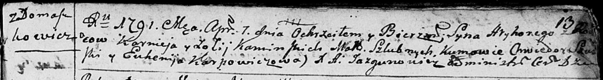

Дедиловичская Покровская церковь. 1 апреля 1791 года. Метрическая запись
о крещении.

Kaminski Hryhory -- сын родителей с деревни Домашковичи.

Kaminski Korniej -- отец.

Kaminska Zofija -- мать.

Saulski? Chwiedor - кум.

Karpowiczowa Euhenija - кума.

Jazgunowicz Antoni -- ксёндз.

**НИАБ 136-13-894:** Лист 15об. **Метрическая запись №25/1792-р
(ориг).**

Дедиловичская Покровская церковь. 16 мая 1792 года. Метрическая запись о
крещении.

Kaminska Elena -- дочь родителей с деревни Домашковичи.

Kaminski Karnej -- отец, селянин.

Kaminska Zosia -- мать, селянка.

Juszkowski Chwiedor - кум.

Karpowiczowa Euhenija - кума.

Jazgunowicz Antoni -- ксёндз.

**НИАБ 136-13-894:** Лист 20. **Метрическая запись №55/1793-р (ориг).**

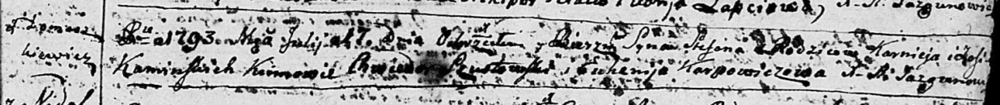

Дедиловичская Покровская церковь. 17 июля 1793 года. Метрическая запись
о крещении.

Kaminski Stefan -- сын родителей с деревни Домашковичи.

Kaminski Karniej -- отец.

Kaminska Zofija -- мать.

Szustowski Chwiedor - кум.

Karpowiczowa Euhenija - кума.

Jazgunowicz Antoni -- ксёндз.

**РГИА 823-2-18:** Лист 248. **Метрическая запись №29/1793-р (коп).**

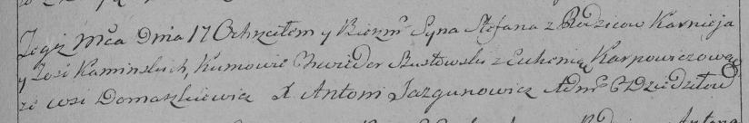

Дедиловичская Покровская церковь. 17 июля 1793 года. Метрическая запись
о крещении.

Kaminski Stefan -- сын родителей с деревни Домашковичи.

Kaminski Karniey -- отец.

Kaminska Zosia -- мать.

Szustowski Chwiedor -- кум.

Karpowiczowa Euhenia -- кума.

Jazgunowicz Antoni -- ксёндз.

**НИАБ 136-13-894:** 24об. **Метрическая запись №25/1795-р (ориг).**

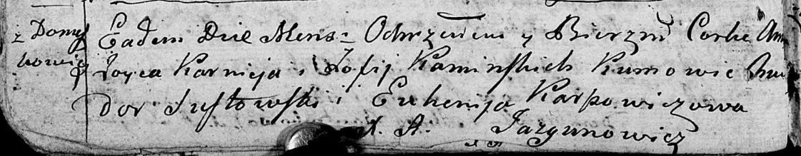

Дедиловичская Покровская церковь. 25 июля 1795 года. Метрическая запись
о крещении.

Kaminska Anna -- дочь родителей с деревни Домашковичи.

Kaminski Karniey -- отец.

Kaminska Zofija -- мать.

Sustowski Chwiedor - кум.

Karpowiczowa Euhenija - кума.

Jazgunowicz Antoni -- ксёндз.

**РГИА 823-2-18:** Лист 252об. **Метрическая запись №20/1795-р (коп).**

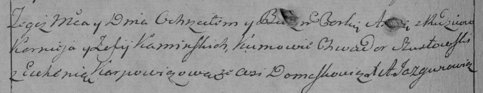

Дедиловичская Покровская церковь. 25 июля 1795 года. Метрическая запись
о крещении.

Kaminska A\[nna\] -- дочь родителей с деревни Домашковичи.

Kaminski Korniey -- отец.

Kaminska Zofija -- мать.

Szustowski Chwiedor -- кум.

Karpowiczowa Euhenija -- кума.

Jazgunowicz Antoni -- ксёндз.

**НИАБ 136-13-920:** 3об. **Метрическая запись №14/1796-б (ориг).**

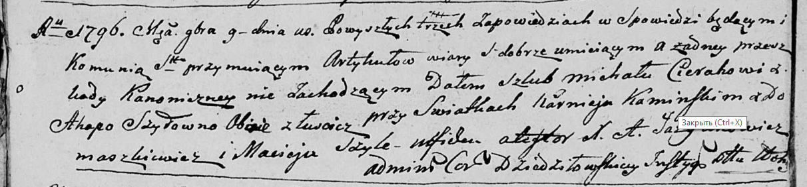

Дедиловичская Покровская церковь. 9 ноября 1796 года. Метрическая запись
о венчании.

Cierach Michał -- жених, деревня Лустичи.

Szyłowna Ahapa -- невеста, деревня Лустичи.

Kaminski Karniey -- свидетель, деревня Домашковичи.

Szyła Maciey -- свидетель.

Jazgunowicz Antoni -- ксёндз.

**НИАБ 136-13-894:** Лист 36об. **Метрическая запись №35/1798-р
(ориг).**

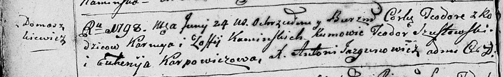

Дедиловичская Покровская церковь. 24 июня 1798 года. Метрическая запись
о крещении.

Kaminska Teodora -- дочь родителей с деревни Домашковичи.

Kaminski Karniey -- отец.

Kaminska Zoffija -- мать.

Szustowski Teodor - кум.

Karpowiczowa Euhenija - кума.

Jazgunowicz Antoni -- ксёндз.

**РГИА 823-2-18:** Лист 265. **Метрическая запись №35/1798-р (коп).**

Дедиловичская Покровская церковь. \[24 июня\] 1798 года. Метрическая
запись о крещении.

Kaminska Theodora -- дочь родителей с деревни \[Домашковичи\].

Kaminski Karniey -- отец.

Kaminska Zofija -- мать.

Susztowski Theodor -- кум.

Karpowiczowa Euhenija -- кума.

Jazgunowicz Antoni -- ксёндз.

**НИАБ 937-4-32:** Лист 9. **Метрическая запись №5/1803-р.**

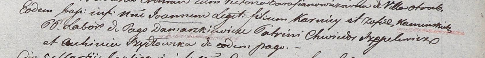

Дедиловичский костел Наисвятейшего Сердца Иисуса. 22 февраля 1803 года.
Метрическая запись о крещении.

Kaminski Joann -- сын крестьян с деревни Домашковичи.

Kaminski Korniey -- отец.

Kaminska Zofia -- мать.

Szepelewicz Chwiedor -- крестный отец.

Szydłowska Auhinia -- крестная мать, с деревни Домашковичи.

Linhart Hyacinthus -- ксёндз.

**НИАБ 136-13-894:** Лист 61. **Метрическая запись №40/1806-р (ориг).**

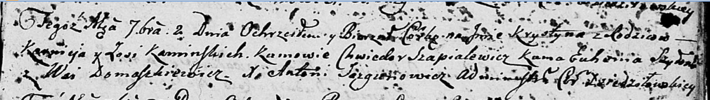

Дедиловичская Покровская церковь. 2 сентября 1806 года. Метрическая
запись о крещении.

Kaminska Krystyna -- дочь родителей с деревни Домашковичи.

Kaminski Karniey -- отец.

Kaminska Zosia -- мать.

Szapialewicz Chwiedor -- кум.

Szyłowa Euhenia -- кума.

Jazgunowicz Antoni -- ксёндз.
