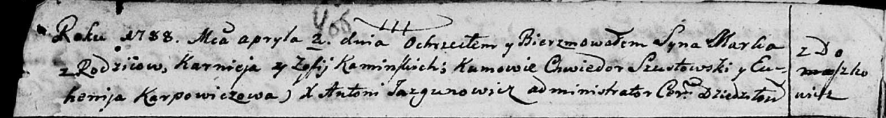
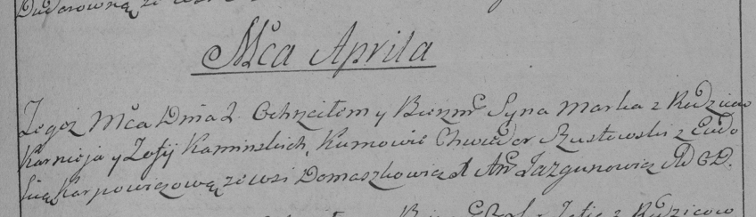

**Каминский Марко Карнеев (Kaminski Marko)**

2 апреля 1788 г -- крещение (НИАБ 136-13-894, лист 4об, №27/1788-р
(ориг)), (РГИА 823-2-18, лист 236, №11/1788-р (коп)).

**НИАБ 136-13-894:** Лист 4-об. **Метрическая запись №27/1788-р
(ориг).**

Дедиловичская Покровская церковь. 2 апреля 1788 года. Метрическая запись
о крещении.

Kaminski Mark -- сын родителей с деревни Домашковичи.

Kaminski Karniej -- отец.

Kaminska Zofija -- мать.

Szustowski Chwiedor - кум.

Karpowiczowa Euhenija - кума.

Jazgunowicz Antoniusz -- ксёндз.

**РГИА 823-2-18:** Лист 236. **Метрическая запись №11/1788-р (коп).**

Дедиловичская Покровская церковь. 2 апреля 1788 года. Метрическая запись
о крещении.

Kaminski Marko -- сын родителей с деревни Домашковичи.

Kaminski Karniey -- отец.

Kaminska Zofija -- мать.

Szustowski Chwiedor -- кум.

Karpowiczowa Eudokija - кума.

Jazgunowicz Antoni -- ксёндз.
