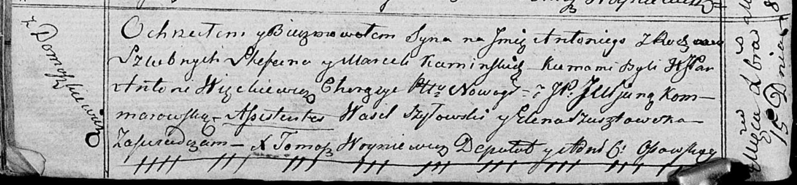

**Каминский Антоний Стефанов (Kaminski Antoni)**

15 декабря 1818 г -- крещение (НИАБ 136-13-894, лист 99об, №45/1818-р
(ориг)).

**НИАБ 136-13-894:** Лист 99об. **Метрическая запись №45/1818-р
(ориг).**

Осовская Покровская церковь. 15 декабря 1818 года. Метрическая запись о
крещении.

Kaminski Antoni -- сын родителей с деревни Домашковичи.

Kaminski Stefan -- отец.

Kaminska Marija -- мать.

Węnckiewicz Antoni, JP -- кум, шляхтич, хорунжий Новогрудский.

Komarowska Juljana, JP -- кума, шляхтянка.

Szyłowski Maxim -- ассистент.

Szusztowska Elena -- ассистентка.

Woyniewicz Tomasz -- ксёндз.
