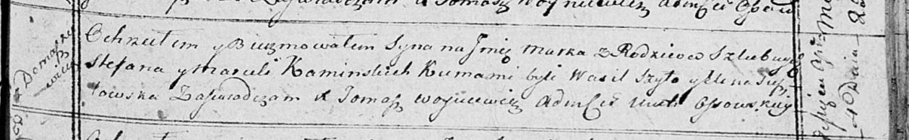

**Каминская Марцеля (Kaminska Marcela)**

4 апреля 1815 г -- крещение сына Марка (НИАБ 136-13-894, лист 92,
№19/1815-р (ориг)).

**НИАБ 136-13-894:** Лист 92. **Метрическая запись №19/1815-р (ориг).**

{width="6.496527777777778in"
height="1.0124628171478565in"}

Осовская Покровская церковь. 4 апреля 1815 года. Метрическая запись о
крещении.

Kaminski Mark -- сын родителей с деревни Домашковичи.

Kaminski Stefan -- отец.

Kaminska Marcela -- мать.

Szyło Wasil -- кум.

Susztowska Elena -- кума.

Woyniewicz Tomasz -- ксёндз.
